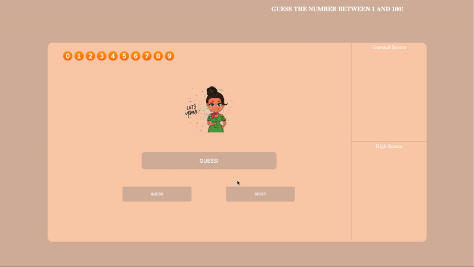

<h3 align="center">
  Hi, I'm Gianni 👋🏾  
  Welcome to my happy place ✨
</h3>

<h3>「 About Me 」</h3>
🔭 I'm a <b>Software Developer</b> and <b>Data Analyst</b> with a background in biology. 
📍 I'm located in the NYC Metropolitan Area. 
🌱 I’m currently studying for the ServiceNow CSA exam. 
⚡ Fun fact: I danced for nine years, specifically jazz, tap, ballet and pointe.

<h3>「 Frameworks, Languages, and Tools 」</h3>

  
  
  
  
  
  
  
<!--    -->

  
  
  
  
  
  
  
  

<h3>「 Featured Projects 」</h3>
  

    
    
    
    
  

<h3>「 Contact Me 」</h3>
  

    
    
    
  

