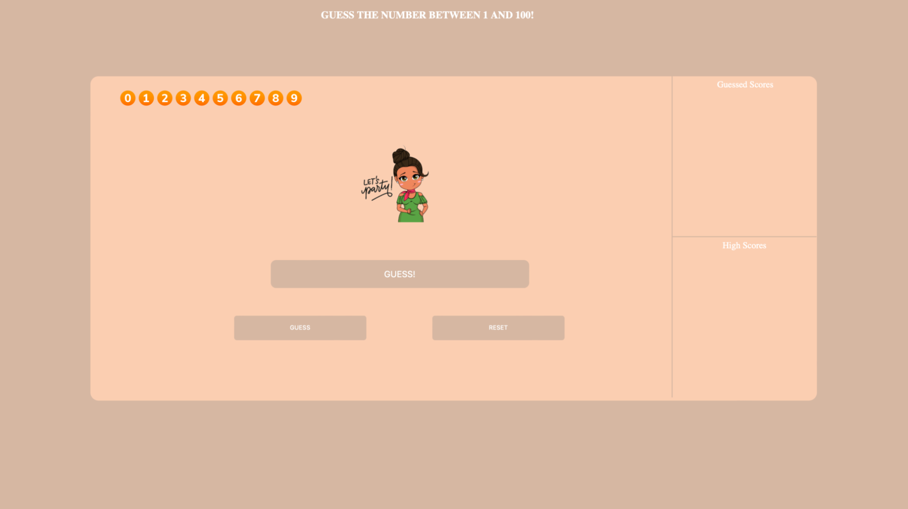

<h3 align="center">
  Hi, I'm Gianni 👋🾠 
  Welcome to my happy place ✨
</h3>

<h3>「 About Me 」</h3>
🔭 I'm a <b>Front-End Developer</b> and <b>Data Science Fellow</b> with a background in biology. 
📠I'm located in the NYC Metropolitan Area. 
🌱 I’m constantly striving to learn and improve as a developer. 
⚡ Fun fact: I danced for nine years, specifically jazz, tap, ballet and pointe.

<h3>「 Frameworks, Languages, and Tools 」</h3>
  

    
    
  

  

    
    
    
  

  

    
    
    
<!--      -->
    
    
    
  

  
  

    
    
  

  

    
    
    
    
  

<h3>「 Notable Projects 」</h3>
  

    
    
    
    
  

<h3>「 Contact Me 」</h3>
  

    
    
    
  

